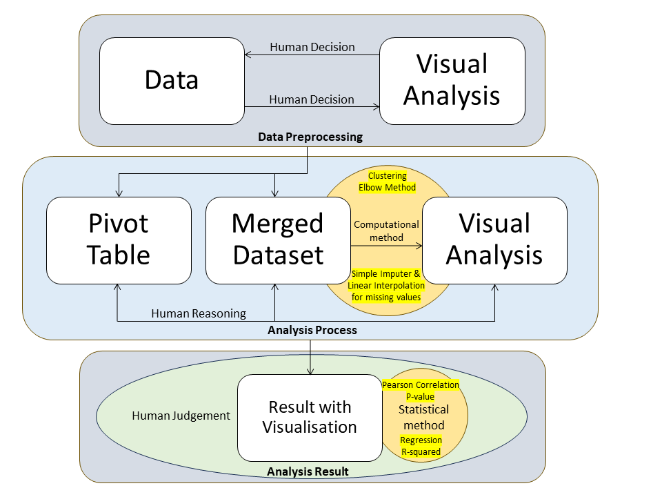

# Visualisation of Terrorist Occurrences Relative to the Economic Index
## Project Overview
The aim of this project is to analyse patterns of terrorism in relation to global economic trends from 2000 to 2021. Specifically, it seeks to understand how fluctuations in the economy such as periods of economic boom or recession correlate with changes in terrorist activity. By examining the timing and frequency of terrorist incidents alongside economic indicators, such as the Dow Jones Industrial Average, the project aims to:
1. Identify any relationships between economic cycles (booms and recessions) and terrorist activity.
2. Determine if specific patterns in terrorism can be observed before, during, or after economic shifts.
3. Assess whether terrorist incidents increase during economic upturns or downturns.

The goal is to provide insights that can help businesses assess potential terrorist threats when operating in different economic conditions, both domestically and internationally.

## Project Files
- **Data**: Cleaned data is stored in the `data/` and raw data is in the `data/raw` folder.
- **Notebooks**: The notebook for data cleaning is located in the `notebooks/` folder.
- **Results**: Visualisations can be found in the `results/figures` folder.

## Analysis Workflow

## Methodology
- **Data Preprocessing**: Ensure Dow Jones Industrial Average (DJIA) data has no null values and plot a line graph for trend analysis. For Global Terror Data (GTD) data, use a heatmap to assess missing values, addressing substantial gaps by either filling, transforming, or excluding variables. With pivot table Transformation, summarise GTD data by frequency and casualties of attacks over time, aligned with DJIA data. Merge GTD and DJIA datasets, handling missing longitude/latitude values with country-based averages, scikit-learn imputation, or linear interpolation. Drop remaining records with missing coordinates if necessary.
- **Data Visualization and Trend Analysis**: Use line graphs for DJIA trends and scatter plots for the number of countries with terrorist attacks. Analyse temporal trends and outliers. Apply Themeriver-style stack plots for attack types, damage, and regional distribution to observe density shifts over time. For K-means Clustering, use DJIA, year, and casualty counts as attributes. Determine optimal clusters using the elbow method, with an initial focus on three clusters and iteration if needed.
- **Statistical Analysis and Hypothesis Testing**: Apply regression to examine DJIA and terrorism correlations, hypothesizing increased terrorism during economic booms. Use Pearson correlation, p-values, and R-squared to evaluate the strength and significance of DJIA-terrorism relationships.

## Key Findings
- **Positive Correlation between DJIA price and the frequency of terrorist incidents**: The regression analysis found a statistically significant positive correlation between DJIA price and the frequency of terrorist incidents, with a Pearson correlation coefficient of 0.5105 and a p-value of 0.000. However, the R-squared value of 0.261 suggests that the DJIA explains only 26.1% of the variability in terrorism frequency, indicating a weak model fit and the presence of other influential factors beyond economic performance as represented by DJIA.
- **Data Gaps and Analytical Limitations**: Merging the GTD and DJIA datasets resulted in data gaps, particularly when aligning on date variables. This incomplete dataset limited the accuracy and scope of insights, particularly for time-sensitive trends in terrorism. Visualisation limitations, such as stack plots that obscured smaller values, further complicated the interpretation of lesser-proportion trends, and the lack of refined clustering restricted the clarity of terrorism patterns in different regions over time.
- **Economic Indicator Insufficiency**: The DJIA alone did not capture the full spectrum of economic trends influencing terrorism. Terrorism is a multifaceted phenomenon influenced by numerous political, social, and economic variables that the DJIA does not fully encapsulate.

## Used Datasets
- **Dow Jones Industrial Average Historical Price Data**: https://uk.investing.com/indices/us-30-historical-data
- **Global Terrorism Data**: https://www.start.umd.edu/gtd/
